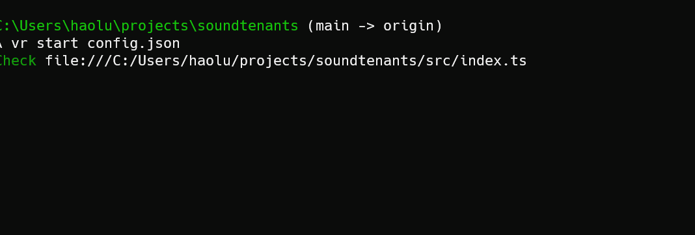

# SoundTenants

A messaging testing tool to see how your multi-tenant messaging system handle noisy neighbors.



## Features (& Goals)

* Cross-Platform
* Flexible
* Provider-Agnostic

## Getting Started

### Using `Deno`

1. Install [Deno](https://deno.land/#installation) and [Velociraptor](https://velociraptor.run/docs/installation/)
2. Clone this Repo
3. Now you can run `vr help` to see the possible commands
4. In the root project folder, run `vr init <filename>` (ie `soundtenants init config.json`) to create a new Config json file
5. Edit the config json file (see details in the next section)
6. Run `vr start <filename>` to start the test.

### Using Docker

Coming Soon.

### Using Native Binary

As soon as [Deno compiled binary supports web workers](https://github.com/denoland/deno/issues/8654)

## Understanding the Config file

In order to fully utilize this tool, it's important to understand the concepts that makes this tool flexible. You can see [some example config files here](https://github.com/howlowck/soundtenants/tree/main/src/configStubs).

There are two main components to the config file: `workers` and `sources`. Workers describe "what" messages to send, and "Sources" describe the "how": how to compose the messages, and how to send them.

## Workers

Workers are the agents that will publish the messages. You can specify an array of workers, all workers will start and execute in parallel, publishing the messages per its specified pattern.

```ts
export type WorkerConfig = {
 pattern: string, // the pattern string
 repeat: number // how many times to repeat the pattern
}
```

The pattern sequence is read left-to-right (left most message in the pattern is published first).
Here are the components to the pattern schema: `<sourceId>*<count>,...,(<ratio>:<sourceId>|<ratio>:<sourceId>|...)`.

## Sources

A source describes how to publish and generate a message. It has these following properties:

```ts
export type SourceConfig = {
 id: string, // the id of the source used by the pattern in a `worker`, recommend to use a single letter for ease of composing the pattern
 groupName: string, // the pivot point for aggregation, recommend using the tenant name or specific topic depending on the target scenario
 targetTopic: string, // the endpoint to the topic (right now only 'http' are supported)
 types: Array<'cart'|'inventory'|'payment'> // an array of possible message types to generate
}
```
